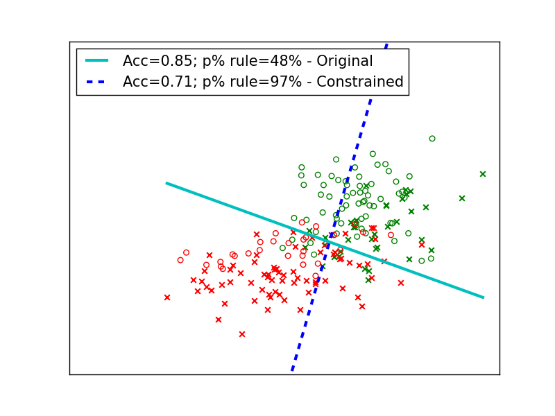
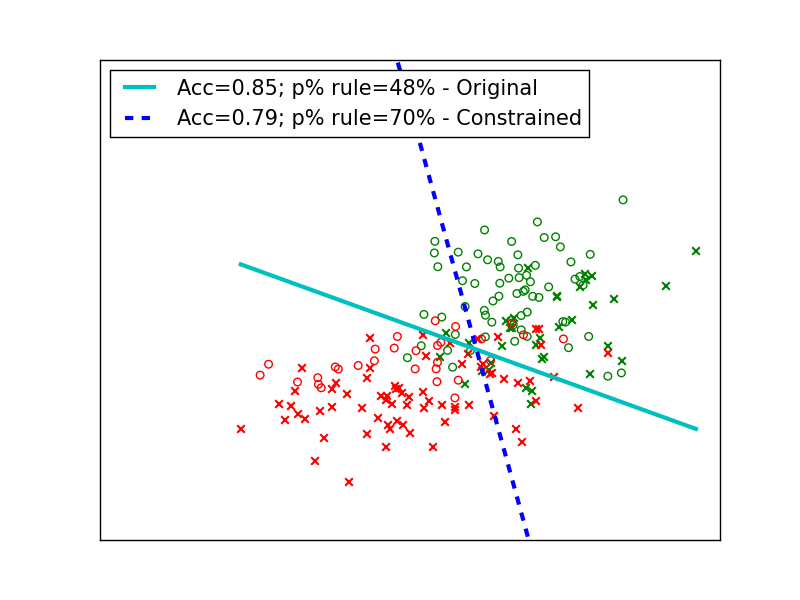
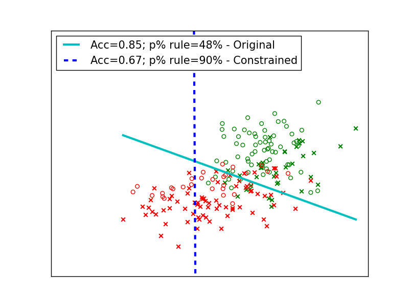

# Classification without disparate impact

## 1. Fair classification demo

Fair classification corresponds to a scenario where we are learning classifiers from a dataset that is biased towards/against a specific demographic group, yet the classifier predictions are fair and do not show the biases contained in the data. For more details, have a look at Section 2 of our [paper](http://arxiv.org/abs/1507.05259).

### 1.1. Generating a biased dataset
Lets start off by generating a sample dataset where class labels are biased towards a certain group.

```shell
$ cd synthetic_data_demo
$ python decision_boundary_demo.py
```

The code will generate a dataset with a multivariate normal distribution. The data consists of two non-sensitive features and one sensitive feature.


Green color denotes the positive class while red denotes negative. Circles represent the non-protected group while crosses represent the protected group. It can be seen that class labels (green and red) are highly correlated with the sensitive feature value (protected and non-protected), that is, most of the green (positive class) points are in the non-protected class while most of red (negative class) points are in the protected class. **Close the figure** for the code to continue. Next, the code will output the following details about the dataset:

```
Total data points: 2000
# non-protected examples: 914
# protected examples: 1086
Non-protected in positive class: 642 (70%)
Protected in positive class: 358 (33%)
P-rule is: 47%
```

The p-rule is essentially the ratio of (fractions of) protected and non-protected examples in the positive class. According to the [doctrine of disparate impact](https://en.wikipedia.org/wiki/Disparate_impact), fair systems should maintain a p-rule of at least 80%. More discussion on p-rule can be found in our [paper](http://arxiv.org/pdf/1507.05259.pdf) (Section 2).

### 1.2. Training an unconstrained classifier on the biased data

Next, we will train a logistic regression classifier on the data to see the correlations between the classifier decisions and sensitive feature value:

```python
# all constraint flags are set to 0 since we want to train an unconstrained (original) classifier
apply_fairness_constraints = 0
apply_accuracy_constraint = 0
sep_constraint = 0
w_uncons, p_uncons, acc_uncons = train_test_classifier()
```

We are training the classifier without any constraints (more on constraints to come later). "train_test_classifier()" will in turn call the function "train_model(...)":

```python
ut.train_model(x_train, y_train, x_control_train, loss_function, apply_fairness_constraints, apply_accuracy_constraint, sep_constraint, sensitive_attrs, sensitive_attrs_to_cov_thresh, gamma)
```

Following output is generated by the program:

```
== Unconstrained (original) classifier ==
Accuracy: 0.85
Protected/non-protected in +ve class: 33% / 70%
P-rule achieved: 48%
Covariance between sensitive feature and decision from distance boundary : 0.809
```

We can see that the classifier decisions reflect the biases contained in the original data, and the p-rule is 48%, showing the unfairness of classifier outcomes. The reason why the classifier shows similar biases as ones contained in the data is that the classifier model tries to minimize the loss (or maximize the accuracy) on the training data by learning the patterns in the data as best as possible. One of the patterns was the unfairness w.r.t. the sensitive feature, and the classifier ended up learning that as well.

### 1.3. Optimizing classifier accuracy subject to fairness constraints

Next, we will try to make these outcomes fair by still **optimizing for classifier accuracy**, but **subject it to fairness constraints**. Refer to Section 3.2 of our [paper](http://arxiv.org/pdf/1507.05259.pdf) for more details.

```python
apply_fairness_constraints = 1 # set this flag to one since we want to optimize accuracy subject to fairness constraints
apply_accuracy_constraint = 0
sep_constraint = 0
sensitive_attrs_to_cov_thresh = {"s1":0}
w_f_cons, p_f_cons, acc_f_cons  = train_test_classifier()
```

Notice that setting _{"s1":0}_ means that the classifier should achieve 0 covariance between the sensitive feature (s1) value and distance to the decision boundary. A 0 covariance would mean no correlation between the two variables.

The results for the fair classifier look like this:

```
== Classifier with fairness constraint ==
Accuracy: 0.71
Protected/non-protected in +ve class: 51% / 53%
P-rule achieved: 97%
Covariance between sensitive feature and decision from distance boundary : 0.014
```

We can see that the classifier sacrificed some accuracy to achieve similar fractions of protected/non-protected examples in the positive class. The code will also show how the classifier shifts its boundary to achieve fairness, while making sure that the smallest possible loss in accuracy is incurred.



The figure shows the original decision boundary (without any constraints) and the shifted decision boundary that was learnt by the fair classifier. Notice how the boundary shifts to push more non-protected points to the negative class (and vice-versa).


###1.4. Optimizing fairness subject to accuracy constraints

Now lets try to **optimize fairness** (that does not necessarily correspond to a 100% p-rule) **subject to a deterministic loss in accuracy**. The details can be found in Section 3.3 of our [paper](http://arxiv.org/pdf/1507.05259.pdf).

```python
apply_fairness_constraints = 0 # flag for fairness constraint is set back to0 since we want to apply the accuracy constraint now
apply_accuracy_constraint = 1 # now, we want to optimize fairness subject to accuracy constraints
sep_constraint = 0
gamma = 0.5
w_a_cons, p_a_cons, acc_a_cons = train_test_classifier()    
```

The "gamma" variable controls how much loss in accuracy we are willing to take while optimizing for fairness. A larger value of gamma will result in more fair system, but we will be getting a more loss in accuracy.

The results and the decision boundary for this experiment are:

```
== Classifier with accuracy constraint ==
Accuracy: 0.79
Protected/non-protected in +ve class: 46% / 66%
P-rule achieved: 70%
Covariance between sensitive feature and decision from distance boundary : 0.155
```



You can experiment with more values of gamma to see how allowing more loss in accuracy leads to more fair boundaries.


### 1.5. Constraints on misclassying positive examples

Next, lets try to train a fair classifier, however, lets put an additional constraint: do not misclassify any non-protected points that were classified in positive class by the original (unconstrained) classifier! The idea here is that we only want to promote the examples from protected group to the positive class, without demoting any non-protected points from the positive class (this might be a business necessity in many scenarios). Details of this formulation can be found in Section 3.3 of our [paper](http://arxiv.org/pdf/1507.05259.pdf). The code works as follows:

```python
apply_fairness_constraints = 0 # flag for fairness constraint is set back to0 since we want to apply the accuracy constraint now
apply_accuracy_constraint = 1 # now, we want to optimize accuracy subject to fairness constraints
sep_constraint = 1 # set the separate constraint flag to one, since in addition to accuracy constrains, we also want no misclassifications for certain points (details in demo README.md)
gamma = 2000.0
w_a_cons_fine, p_a_cons_fine, acc_a_cons_fine  = train_test_classifier()
```

The output looks like:

```
== Classifier with accuracy constraint (no +ve misclassification) ==
Accuracy: 0.67
Protected/non-protected in +ve class: 81% / 90%
P-rule achieved: 90%
Covariance between sensitive feature and decision from distance boundary : 0.075

```



Notice the movement of decision boundary: we are only moving points to the positive class to achieve fairness (and not moving any non-protected point that was classified as positive by the original classifier to the negative class).

### 1.6. Understanding trade-offs between fairness and accuracy
Remember, while optimizing for accuracy subject to fairness constraints, we forced the classifier to achieve perfect fairness by setting the covariance threshold to 0. This resulted in a perfectly fair classifier but we had to incur a rather big loss in accuracy (0.71 from 0.85). Lets see if we try a range of fairness values (not necessarily 100% p-rule), what kind of accuracy we will be achieving. We will do that by trying a range of values of covariance threshold (not only 0!) for this purpose. Execute the following command:

```shell
$ cd synthetic_data_demo
$ python fairness_acc_tradeoff.py
```

The code will generate the synthetic data as before, and call the following function:

```python
ut.plot_cov_thresh_vs_acc_pos_ratio(X, y, x_control, NUM_FOLDS, loss_function, apply_fairness_constraints, apply_accuracy_constraint, sep_constraint, ['s1'])
```

The following output is generated:


We can see that decreasing the covariance threshold value gives a continuous trade-off between fairness and accuracy. Specifically, we see that the fractions of protected and non-protected examples in positive class starts to converge (resulting in a greater p-rule), however, we get an increasing drop in accuracy.

###1.7. Adult data

We also provide a demo of our code on [Adult dataset](http://archive.ics.uci.edu/ml/datasets/Adult). For applying the fairness constraints on the adult dataset, execute the following commands:

```shell
$ cd adult_data_demo
$ python demo_constraints.py
```

## 2. Using the code

### 2.1. Training a(n) (un)fair classifier

For training a fair classifier, set the values for constraints that you want to apply, and call the following function:

```python
import utils as ut

apply_fairness_constraints = 0
apply_accuracy_constraint = 0
sep_constraint = 0
gamma = 0
w = ut.train_model(x_train, y_train, x_control_train, loss_function, apply_fairness_constraints, apply_accuracy_constraint, sep_constraint, sensitive_attrs, sensitive_attrs_to_cov_thresh, gamma)
```

The function resides in file "fair_classification/utils.py". **Documentation about the type/format of the variables can be found at the beginning of the function**.

Setting all the constraint values to 0 will train an unconstrained (original) logistic regression classifier. You can choose the constraint values selectively depending on which fairness formulation you want to use (**examples for each case provided in the demo above**).

### 2.2. Making predictions

The function will return the weight vector learned by the classifier. Given an _(n)_ x _(d+1)_ array _X_ consisting of data _n_ points (and _d_ features -- first column in the weight array is for the intercept, and should be set to 1 for all data points), you can make the classifier predictions using the weight vector as follows:

```python
distance_boundary = numpy.dot(w, X) # will give the distance from the decision boundary
predicted_labels = np.sign(class_probabilities) # sign of the class probability is the class label
```

For using k-fold cross validation, call the function "ut.compute_cross_validation_error(...)". This function will automatically split the data into k (specified by user) train/test folds and return the accuracy and fairness numbers.
