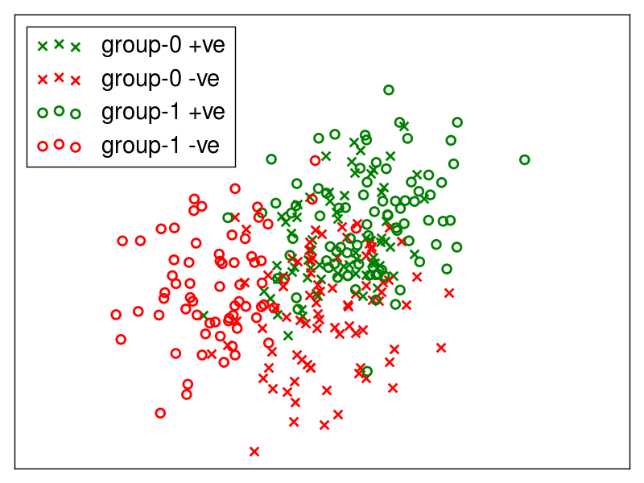
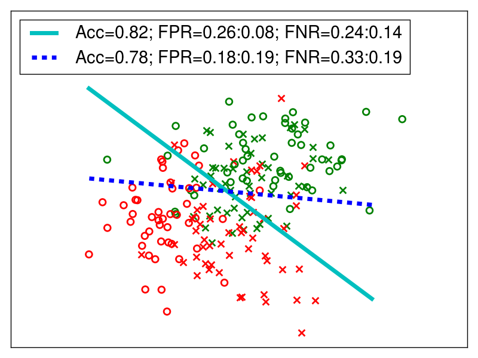
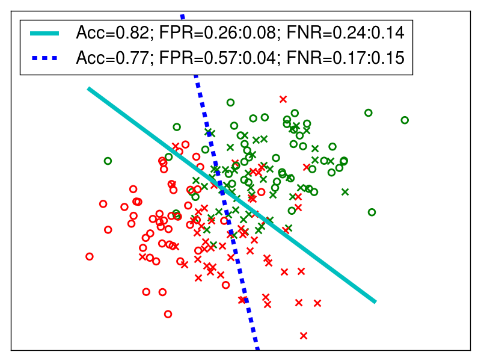
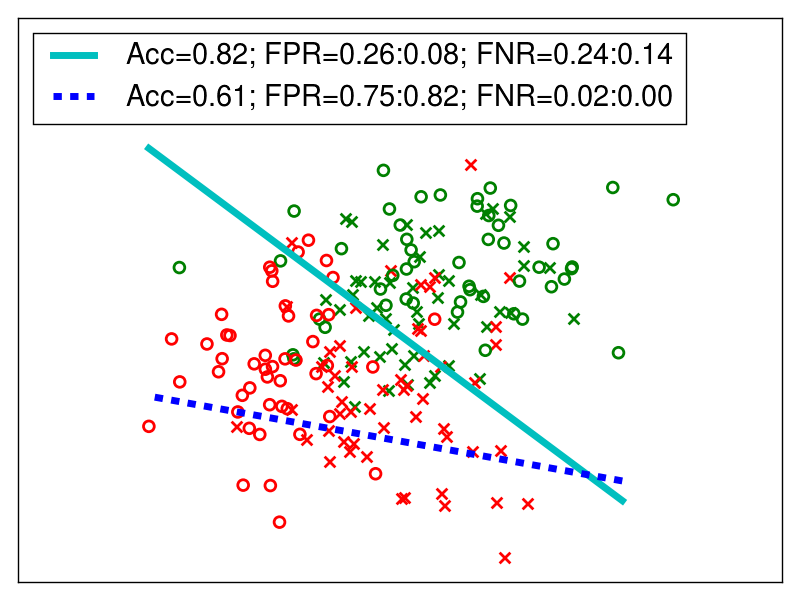
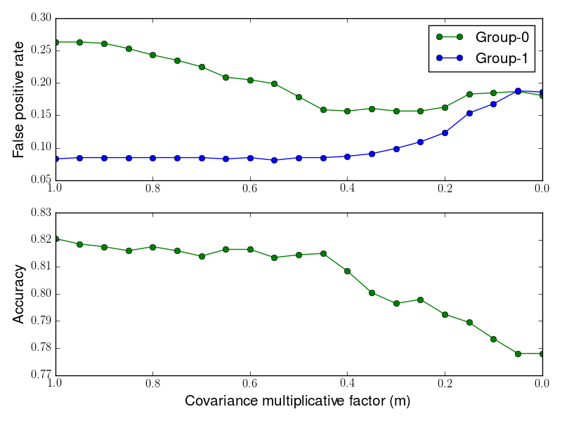

# Classification without disparate mistreatment

  * [1. Fair classification demo](#1-fair-classification-demo)
     * [1.1. Generating a sample dataset](#11-generating-a-sample-dataset)
     * [1.2. Training an unconstrained classifier](#12-training-an-unconstrained-classifier)
     * [1.3. Removing unfairness w.r.t. false positive rate](#13-removing-unfairness-wrt-false-positive-rate)
     * [1.4. Removing unfairness w.r.t. false negative rate](#14-removing-unfairness-wrt-false-negative-rate)
     * [1.5. Removing unfairness w.r.t. <em>both</em> false positive and negative rate](#15-removing-unfairness-wrt-both-false-positive-and-negative-rate)
     * [1.6. However...](#16-however)
     * [1.7. Understanding trade-offs between fairness and accuracy](#17-understanding-trade-offs-between-fairness-and-accuracy)
     * [1.8. ProPublica COMPAS dataset](#18-propublica-compas-dataset)
  * [2. Using the code](#2-using-the-code)
     * [2.1. Training a(n) (un)fair classifier](#21-training-an-unfair-classifier)
     * [2.2. Making predictions](#22-making-predictions)
  * [3. Code update](#3-code-update)

## 1. Fair classification demo

Imagine we are training classifiers on a given dataset and the learned classifier results in different misclassification rates for different demographic groups. Fair classification here corresponds to removing such disparities in misclassification rates from classification outcomes.

For more details, have a look at our <a href="http://arxiv.org/abs/1610.08452" target="_blank">paper</a>.

### 1.1. Generating a sample dataset
Lets start off by generating a sample dataset.

```shell
$ cd synthetic_data_demo
$ python decision_boundary_demo.py
```

The code will generate a dataset with a multivariate normal distribution. The data consists of two non-sensitive features and one sensitive feature. Sensitive feature encodes the demographic group (e.g., gender, race) of each data point. 




Green color denotes the positive class while red denotes the negative class. The sensitive feature here takes two values: 0 and 1. So the dataset tries to simulate two different demographic groups. You can notice that the positive and negative classes for group-0 (crosses) have a different distribution as compared to the positive and negative classes for group-1 (circles). As a result, a classifier trained on this data might have different accuracy (or misclassification rates) for different groups. Let us confirm if this actually happens.

_Close the figure to continue the code._

### 1.2. Training an unconstrained classifier

Next, the code will train a logistic regression classifier on the data:

```python
w_uncons, acc_uncons, s_attr_to_fp_fn_test_uncons = train_test_classifier()
```

We are training the classifier without any constraints (more on constraints to come later).
The following output is generated by the program:

```
== Unconstrained (original) classifier ==

Accuracy: 0.821
||  s  || FPR. || FNR. ||
||  0  || 0.26 || 0.24 ||
||  1  || 0.08 || 0.14 ||
```

We see that the classifier has very different misclassification rates for the two groups. Specifically, both false positive as well as false negative rates for group-0 are higher than those for group-1. That is, a classifier optimizing for misclassification rates (or, accuracy) on the whole dataset leads to different misclassification rates for the two demographic groups.
This may be unfair in certain scenarios. For example this could be a classifier that is making decisions to grant loans to the applicants, and having different misclassification rates for the two groups can be considered unfair.
Let us try to fix this unfairness. 

We will first try to fix disparate false positive rates for both groups:

### 1.3. Removing unfairness w.r.t. false positive rate


```python
cons_type = 1 # FPR constraint -- just change the cons_type, the rest of parameters should stay the same
tau = 5.0
mu = 1.2
sensitive_attrs_to_cov_thresh = {"s1": {0:{0:0, 1:0}, 1:{0:0, 1:0}, 2:{0:0, 1:0}}} # zero covariance threshold, means try to get the fairest solution
cons_params = {"cons_type": cons_type, 
               "tau": tau, 
                "mu": mu, 
                "sensitive_attrs_to_cov_thresh": sensitive_attrs_to_cov_thresh}

w_cons, acc_cons, s_attr_to_fp_fn_test_cons  = train_test_classifier()
```

Notice that setting all values to 0 in _sensitive_attrs_to_cov_thresh_ means that the classifier should achieve 0 covariance between the sensitive feature (s1) value and distance to the decision boundary for the points misclassified as false positives. Refer to Section 4 of our <a href="http://arxiv.org/abs/1610.08452" target="_blank">paper</a> for more details.

The results for the fair classifier look like this:

```
=== Constraints on FPR ===

Accuracy: 0.774
||  s  || FPR. || FNR. ||
||  0  || 0.16 || 0.37 ||
||  1  || 0.16 || 0.21 ||
```

So, the classifier sacrificed around 5% of (overall) accuracy to remove disparity in false positive rates for the two groups. Specifically, it decreased the FPR (as compared to the original classifier) for group-0 and increased the FPR for group-1. The code will also show how the classifier shifts its boundary to achieve fairness, while making sure that a minimal loss in overall accuracy is incurred.



The figure shows the original decision boundary (without any constraints, solid line) and the fair decision boundary (dotted line) resulting from the constraints on false positive rates. Notice how the boundary shifts to push some previously misclassified points from group-0 into the negative class (_decreasing_ its false positive rate) and some correctly classified points from group-1 into the positive class (_increasing_ its false positive rate). Also, the false negative rates for both groups, while different from that of the original classifier, still show some disparity.


### 1.4. Removing unfairness w.r.t. false negative rate

Now, lets try to remove disparity in false negative rates.

```python
cons_type = 2
cons_params["cons_type"] = cons_type # FNR constraint -- just change the cons_type, the rest of parameters should stay the same
w_cons, acc_cons, s_attr_to_fp_fn_test_cons  = train_test_classifier()  
```

The results and the decision boundary for this experiment are:

```
=== Constraints on FNR ===

Accuracy: 0.768
||  s  || FPR. || FNR. ||
||  0  || 0.58 || 0.16 ||
||  1  || 0.04 || 0.14 ||
```



Notice that: (i) the rotation of boundary to fix false negative rate is different as compared to the previous case and (ii) the FNR constraints fixed disparity on false negative rate, but the disparity on false positive rates got even worse!

Next, lets try to fix disparity with respect to both false positive as well as false negative rates.


### 1.5. Removing unfairness w.r.t. _both_ false positive and negative rate

```python
cons_type = 4
cons_params["cons_type"] = cons_type # both FPR and FNR constraints
w_cons, acc_cons, s_attr_to_fp_fn_test_cons  = train_test_classifier()
```

The output looks like:

```
=== Constraints on both FPR and FNR ===

Accuracy: 0.637
||  s  || FPR. || FNR. ||
||  0  || 0.68 || 0.02 ||
||  1  || 0.76 || 0.00 ||
```



We see that: (i) disparity on both false positive as well as false negative rates is fixed by moving the boundary by a larger margin as compared to the previous two cases and (ii) we have to incur a much bigger loss in accuracy to achieve fairness (with respect to both rates).

### 1.6. However...

These shifts in boundary can be very different in different settings. For example, in certain cases (depending on the underlying data distribution), fixing unfairness w.r.t. false positive rates can also fix disparity on false negative rates (as we will see a little later). Similarly, the precise amount of accuracy that we have to trade-off to achieve fairness will also vary depending on the specific dataset. We experiment with some of these scenarios in Section 5 of our <a href="http://arxiv.org/abs/1610.08452" target="_blank">paper</a>.

Also, one might wish for overall misclassification (irrespective of whether these misclassifications are false positives or false negative) to be the same. 
Such scenarios can be simulated by passing ```cons_type=0``` to ```cons_params``` variable.

### 1.7. Understanding trade-offs between fairness and accuracy
Remember, until now, we forced the classifier to achieve perfect fairness by setting the covariance threshold to 0. In certain scenarios, a perfectly fair classifier might come at a large cost in terms of accuracy. Lets see if we try a range of fairness values (not necessarily equal false positive and/or false negative rates), what kind of accuracy we will be achieving. We will do that by trying a range of values of covariance threshold (not only 0!) for this purpose. Execute the following command:

```shell
$ python fairness_acc_tradeoff.py
```

The code will generate the synthetic data as before, apply the constraints to remove disparity in false positive rates and generate the following output:



We can see that decreasing the covariance threshold value gives a continuous trade-off between fairness and accuracy. Specifically, we see a continuous range of (decreasing) disparity in false positive rates for both groups, and a corresponding drop in accuracy. You can change the variable ```cons_type``` to experiment with other constraints as well.

### 1.8. ProPublica COMPAS dataset

We also provide a demo of our scheme with <a href="https://github.com/propublica/compas-analysis" target="_blank">ProPublica COMPAS dataset</a>. For seeing the effect of fairness constraints on this dataset, execute the following commands:

```shell
$ cd propublica_compas_data_demo/
$ python demo_constraints.py
```

The code will show the stats for an unconstrained (potentially unfair) classifier, and a classifier constrained to have equal false positive rates for two demographic groups, African-Americans (encoded as 0) and Caucasians (encoded as 1). 

```shell
== Unconstrained (original) classifier ==

Accuracy: 0.678
||  s  || FPR. || FNR. ||
||  0  || 0.36 || 0.27 ||
||  1  || 0.18 || 0.59 ||
-----------------------------------------------------------------------------------
== Constraints on FPR ==

Accuracy: 0.659
||  s  || FPR. || FNR. ||
||  0  || 0.24 || 0.43 ||
||  1  || 0.25 || 0.50 ||
```

You will notice that in this dataset, controlling for unfairness w.r.t. false positive rates also helps control unfairness on false negative rates (rather than making it worse, or not affecting it at all). For more discussion, please see Section 5 of our <a href="http://arxiv.org/abs/1610.08452" target="_blank">paper</a>.

## 2. Using the code

### 2.1. Training a(n) (un)fair classifier

For training a fair classifier, set the values for constraints that you want to apply, and call the following function:

```python
import utils as ut
import funcs_disp_mist as fdm

w = fdm.train_model_disp_mist(x_train, y_train, x_control_train, loss_function, EPS, cons_params)
```

The function resides in file "fair_classification/funcs_disp_mist.py". **Documentation about the type/format of the variables can be found at the beginning of the function**.

Passing ```cons_params = None``` will train an unconstrained (original) logistic regression classifier. For details on how to apply fairness constraints w.r.t. all misclassifications, false positive rates, false negative rates, or both, see the function documentation and the demo files above.

Finally, since the constrained classifier needs access to the misclassification covariance of the unconstrained (original) classifier, this information has to be provided as a part of the ```cons_params``` variable. This covariance is computed by the ```get_sensitive_attr_constraint_fpr_fnr_cov(...)``` function in "fair_classification/funcs_disp_mist.py".  Detailed example of how to compute the covariance and how to construct the ```cons_params``` variable can be found in "disparate_mistreatment/synthetic_data_demo/decision_boundary_demo.py".

### 2.2. Making predictions

The function will return the weight vector learned by the classifier. Given an _(n)_ x _(d+1)_ array _X_ consisting of data _n_ points (and _d_ features -- first column in the weight array is for the intercept, and should be set to 1 for all data points), you can make the classifier predictions using the weight vector as follows:

```python
distance_boundary = numpy.dot(w, X) # will give the distance from the decision boundary
predicted_labels = np.sign(distance_boundary) # sign of the distance from boundary is the class label
```


## 3. Code update

We have made changes to constraints for false positive and false negative rates. In the <a href="http://arxiv.org/abs/1610.08452" target="_blank">paper</a>(in Section 4), we compute the misclassification covariance over the whole dataset for _all_ constraint types. However, if the base rates (fraction in positive class in the training dataset) are different for various groups, computing the covariance over the whole dataset could result in under- or over-estimating the false positive / negative rates (the constraints for overall misclassification rates do not get affected by different base rates). To overcome this issue, we have changed the constraints in the following way: for false positive rate constraints, the covariance is computed over the ground truth negative dataset, and for false negative rate constraints, the covariance is computed over the ground truth positive dataset. This way, the constraints do not under- or over-estimate FPR or FNR.
