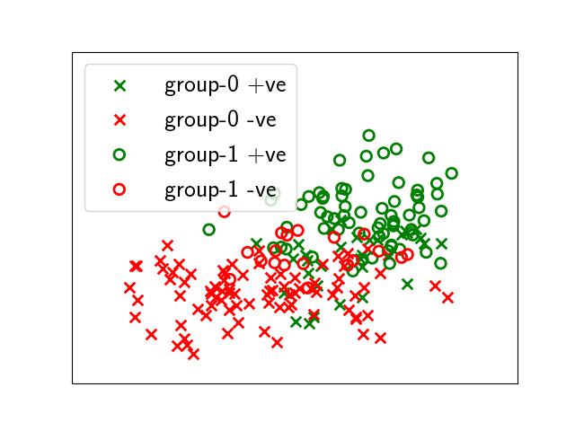
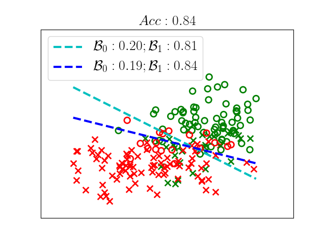
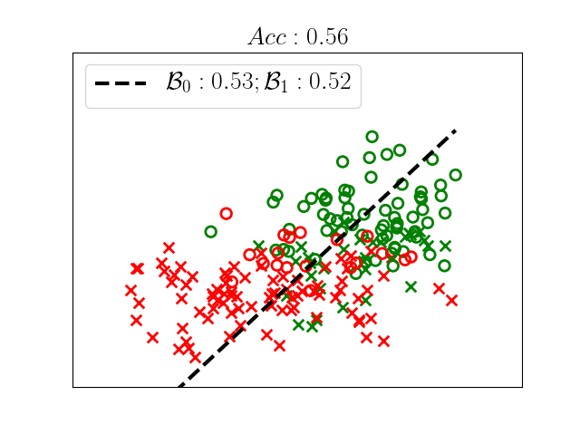
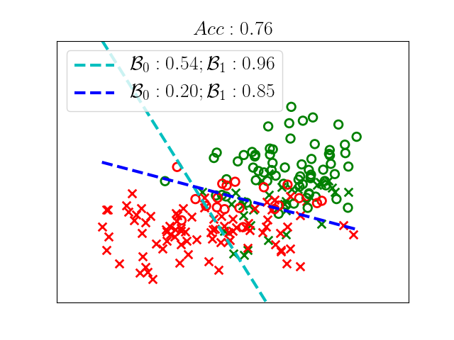
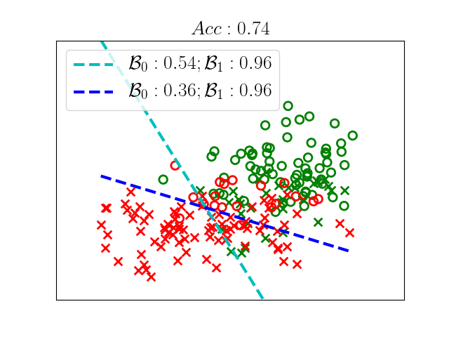

# Preferential fairness

  * [1. Fair classification demo](#1-fair-classification-demo)
     * [1.1. Generating a sample dataset](#11-generating-a-sample-dataset)
     * [1.2. Training an unconstrained classifier](#12-training-an-unconstrained-classifier)
     * [1.3. Training a parity fair classifier](#13-training-a-parity-fair-classifier)
     * [1.4. Training preferentially fair classifiers](#14-training-preferentially-fair-classifiers)
     * [1.5. Adult dataset](#15-adult-dataset)
  * [2. Using the code](#2-using-the-code)


## 1. Fair classification demo

This repository provides the implementation for training preferentially fair classifiers: the classifiers where the benefits (fraction accepted into the positive class) for different groups might be disparate, yet each group would prefer their own decision outcomes.

For more details, have a look at our <a href="https://arxiv.org/abs/1707.00010" target="_blank">paper</a>.

### 1.1. Generating a sample dataset
Lets start off by generating a sample dataset.

```shell
$ cd synthetic_data_demo
$ python decision_boundary_demo.py
```

The code will generate a dataset with a multivariate normal distribution. The data consists of two non-sensitive features and one sensitive feature. Sensitive feature encodes the demographic group (e.g., gender, race) of each data point. 





Green color denotes the positive class while red denotes negative. Circles represent the non-protected group (lets call it group-1) while crosses represent the protected group (lets call it group-0). It can be seen that class labels (green and red) are highly correlated with the sensitive feature value (protected and non-protected), that is, most of the green (positive class) points are in the non-protected class while most of red (negative class) points are in the protected class. 


_Close the figure to continue the code._

### 1.2. Training an unconstrained classifier

Next, the code will train a logistic regression classifier optimizing accuracy for each group separately:

```python
clf = LinearClf(loss_function, lam=lam[s_attr_val], train_multiple=False)
clf.fit(x_train[idx], y_train[idx], x_sensitive_train[idx], cons_params)
```

We are training the classifier without any constraints (more on constraints to come later).
The following output is generated by the program:

```
== Unconstrained classifier ==


Accuracy: 0.840

||  s  ||   frac_pos  ||
||  0  || 0.20 (0.19) ||
||  1  || 0.84 (0.81) ||
```

The "s" column denotes the protected (sensitive feature value 0) and non-protected group. The "frac_pos" column shows the fraction of points from each group selected into the positive class. The number in parentheses show the fraction in positive class had this group been classified using the classifier of the other group. In this case, we see that neither of the group is better off (getting more beneficial outcomes) by using the classifier of the other group. However, we do see examples in certain datasets where one group would prefer the classifier of the other group (details in Section 5 of our paper).

Notice that this classifier violates both treatment parity (disparate treatment)--it trains a separate classifier for each group as well as impact parity--its beneficial outcome rates are different for different groups. Treatment parity (or satisfying disparate treatment) and impact parity (or satisfying disparate impact) are two well-known fairness criteria considered in the literature. See Sections 1 and 2 of our paper (and the discussion therein) for more details.



The cyan line in the figure shows the decision boundary for group-0 (protected group). The legend shows the benefits each group would get by using this boundary. Specifically, 20% of group-0 would get beneficial outcomes by using this boundary whereas 81% of group-1 would get beneficial outcomes by using it.

The accuracy is of course computed by computing the outcomes of each group with their own boundary.

Next, we train a classifier satisfying both these criteria.

### 1.3. Training a parity fair classifier


```python
cons_params["cons_type"] = 0
clf = LinearClf(loss_function, lam=0.01, train_multiple=False)
clf.fit(x_train, y_train, x_sensitive_train, cons_params)
```
This step uses the methodology introduced in our <a href="https://arxiv.org/abs/1507.05259" target="_blank">earlier AISTATS paper</a> for more details.

The results for the fair classifier look like this:

```
== Parity classifier ==


Accuracy: 0.558

||  s  ||   frac_pos  ||
||  0  || 0.53 (0.53) ||
||  1  || 0.52 (0.52) ||

```


The parity classifier achieves both treatment and impact parity--the decisions received by a group (0 or 1) do not change based on the sensitive feature value and both groups get similar fractions of beneficial outcomes by the classifier.



However, note that fairness comes at a very high cost: the classification accuracy drops from 0.84 to 0.56!

Next, we leverage our preference-based fairness notions to reduce the cost of fairness.

### 1.4. Training preferentially fair classifiers

First we train a preferred impact classifier. A classifier that ensures that each group gets at least as much beneficial outcomes as the ones provided by the parity classifier.

```python
cons_params["cons_type"] = 1
cons_params["tau"] = 1
cons_params["s_val_to_cons_sum"] = s_val_to_cons_sum_di
lam = {0:2.5, 1:0.01} 
clf = LinearClf(loss_function, lam=lam, train_multiple=True)
clf.fit(x_train, y_train, x_sensitive_train, cons_params)
```

The results and the decision boundary for this experiment are:

```
== Preferred impact classifier ==


Accuracy: 0.758

||  s  ||   frac_pos  ||
||  0  || 0.54 (0.20) ||
||  1  || 0.85 (0.96) ||

```



Notice that each group is getting at least as much beneficial outcomes as the parity classifier. Also, we are able to meet the preferred impact criterion at a much higher accuracy (0.76 vs. 0.56) as compared to the parity classifier.

However, notice that the preferred impact classifier is not a preferred treatment classifier: group-1 would get more beneficial outcomes by using the decision boundary of group-0 (0.96) as compared the the beneficial outcomes it is getting with its own boundary (0.85).

Next, we train a classifier that is _both_ preferred impact as well as preferred treatment--each group gets as least as much beneficial outcomes as the parity classifier _and_ no group gets more beneficial outcomes by using the classifier (or boundary) of another group.

```python
cons_params["cons_type"] = 3
cons_params["s_val_to_cons_sum"] = s_val_to_cons_sum_di
lam = {0:2.5, 1:0.35}
clf = LinearClf(loss_function, lam=lam, train_multiple=True)
clf.fit(x_train, y_train, x_sensitive_train, cons_params)
```

The output looks like:

```
== Preferred treatment AND preferred impact classifier ==


Accuracy: 0.742

||  s  ||   frac_pos  ||
||  0  || 0.54 (0.36) ||
||  1  || 0.96 (0.96) ||
```

Note that the group benefits satisfy both constraints.




### 1.5. Adult dataset

We also provide a demo of our code on [Adult dataset](http://archive.ics.uci.edu/ml/datasets/Adult). For applying the fairness constraints on the adult dataset, execute the following commands:

```shell
$ cd adult_data_demo
$ python demo_constraints.py
```


## 2. Using the code

You can train a model by calling the fit() function in "fair_classification/linear_clf_pref_fairness.py". The predictions can be made by checking the sign of classifier's distance from boundary. You can use decision_function() in the same file for this part.
